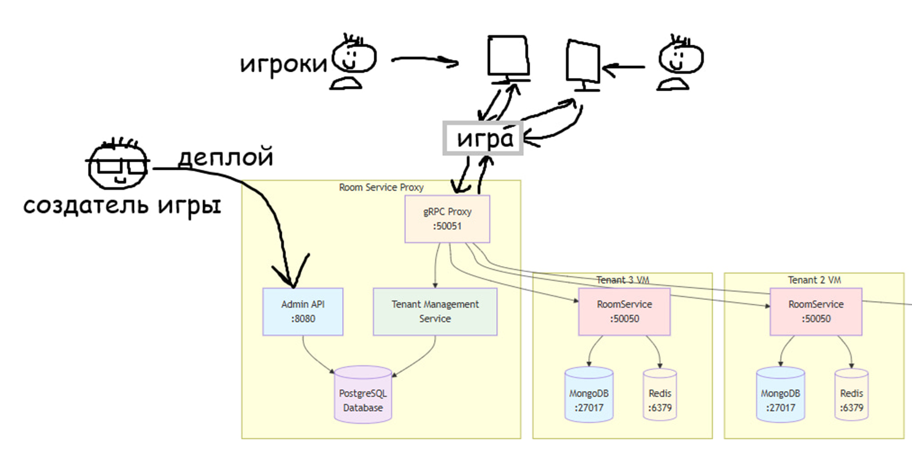
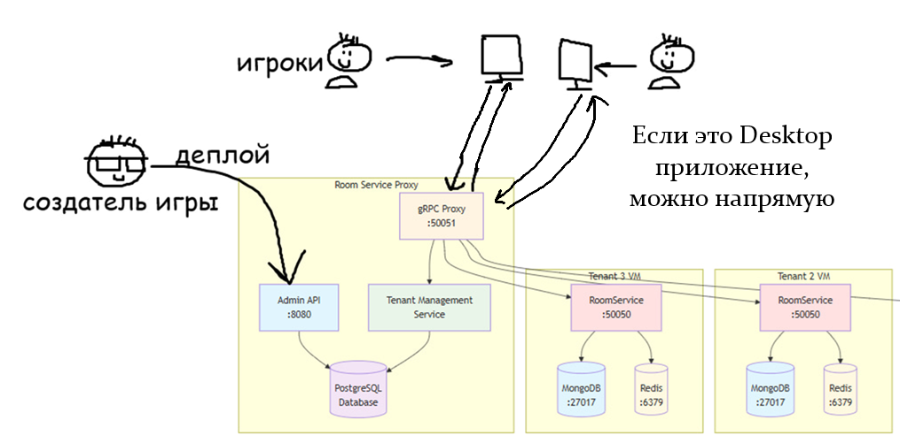
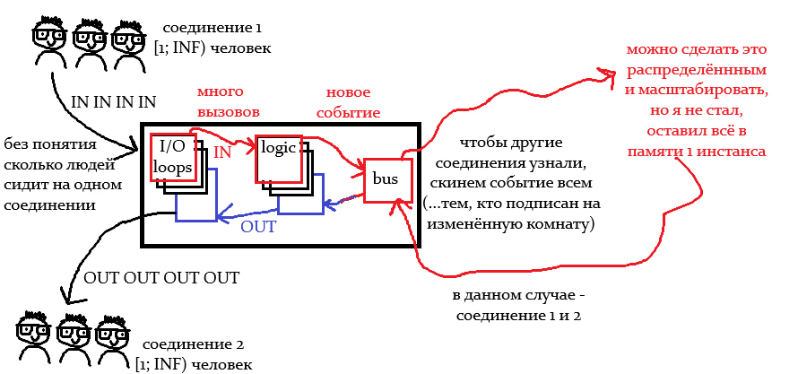
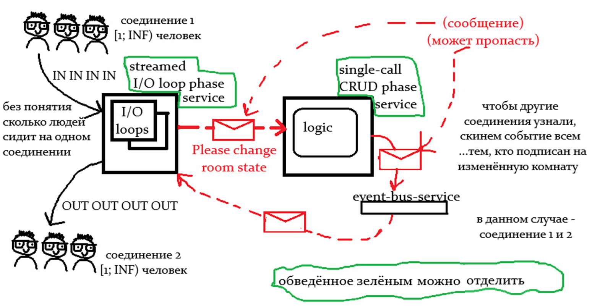
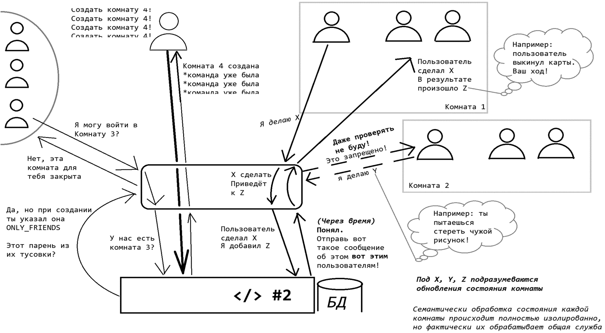
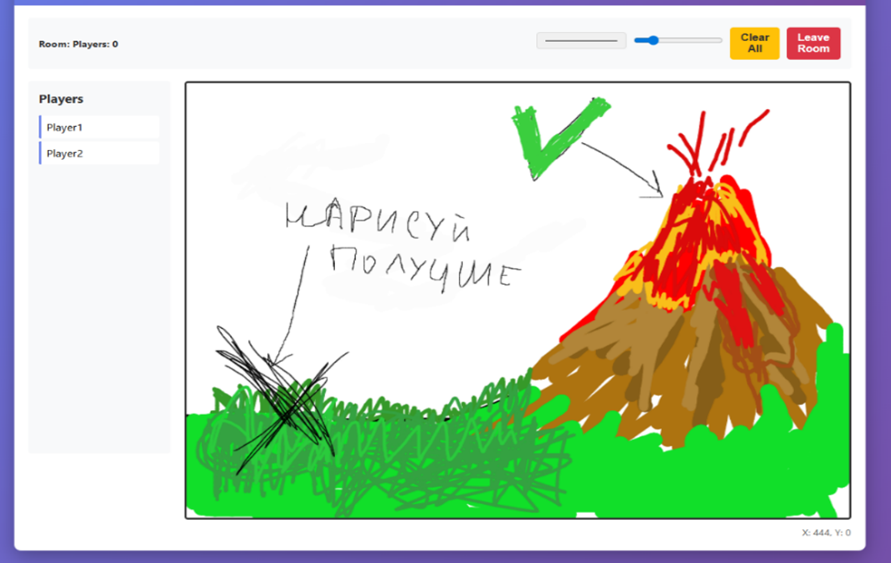

# RoomService

Сервис для управления онлайн-комнатами с реал-тайм взаимодействием участников через gRPC streaming.

## Технологический стек

- **Язык**: Go (Goland)
- **База данных**: MongoDB (хранение состояния комнат)
- **Кэш**: Redis (командный кэш)
- **Протокол**: gRPC (Streaming Server)
- **CI/CD**: GitHub Actions
- **Архитектура**: Event-driven с шиной событий

## Архитектурные решения

### Текущая архитектура

В данный момент сервис реализован как монолитное приложение для простоты развёртывания. Все компоненты работают в едином сервисе с обменом данных через gRPC.

### Компромиссы в дизайне

**Простота vs Масштабируемость**

Текущий подход с единым сервисом и gRPC-соединением прост в развёртывании, но может создавать ограничения при масштабировании.

### План масштабирования

При росте нагрузки планируются следующие изменения:

1. **Переход на Kafka**: замена gRPC на обмен данными через Kafka
2. **Декомпозиция на микросервисы**: разделение на более мелкие сервисы с асинхронным обменом сообщениями
3. Вместо прямых вызовов внутренних методов все изменения состояния комнат будут проходить через шину событий

## Архитектура платформы

### Общая архитектура микросервисов



*Диаграмма показывает место RoomService в общей архитектуре платформы и его взаимодействие с другими сервисами.*

### Прямое подключение клиентов



*Для настольных приложений (например, игр без внутренних серверных проверок) возможно прямое подключение к сервису.*

### Текущая внутренняя структура сервиса



*Внутреннее устройство сервиса в настоящее время — монолитная архитектура с выделенными слоями.*

### Целевая архитектура



*План переработки сервиса с разделением на микросервисы и использованием Kafka.*

### Концепт онлайн-комнат



*Общий концепт организации онлайн-комнат и взаимодействия участников.*

## Пример использования

Сервис успешно протестирован в реальном приложении — простой рисовалке для совместного творчества:



*Демонстрация работы сервиса в приложении для совместного рисования.*

## Основные возможности

- **Создание комнат**: пользователи могут создавать комнаты для совместной работы
- **Присоединение к комнатам**: участники подключаются к активным комнатам
- **Реал-тайм обновления**: все участники видят изменения мгновенно через gRPC streaming
- **Управление состоянием**: CRUD операции над состояниями комнат
- **Event Bus**: событийная модель для оповещения всех подключенных клиентов

## Структура проекта

```
room_service/
├── cmd/                    # Точка входа приложения
├── internal/
│   ├── config/            # Конфигурация приложения
│   ├── models/            # Доменные модели (Room, User, Data)
│   ├── ports/             # Порты (интерфейсы) для внешних зависимостей
│   ├── repositories/      # Реализация репозиториев (MongoDB, Redis)
│   ├── service/           # Бизнес-логика сервиса
│   └── errors/            # Специфические ошибки приложения
├── pkg/
│   ├── api/               # gRPC protobuf определения
│   └── transport/         # Транспортный слой (gRPC сервер)
└── scripts/               # Скрипты сборки и утилиты
```

## Статус проекта

Проект сделан для диплома, и разработка приостановлена. Текущая реализация представляет MVP для проверки концепции онлайн-комнат с реал-тайм взаимодействием.